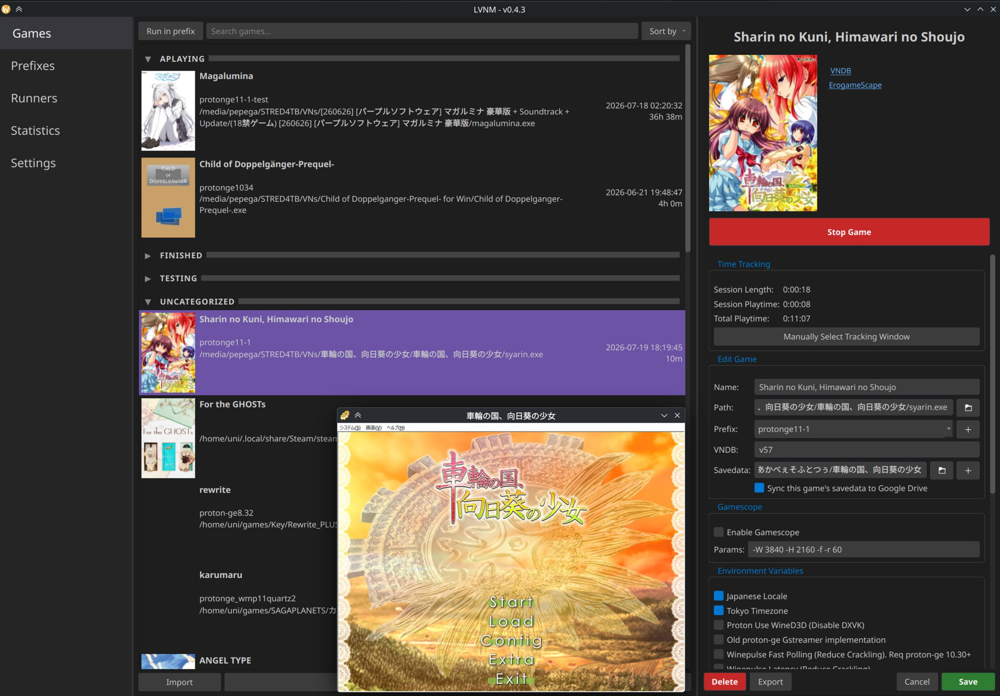
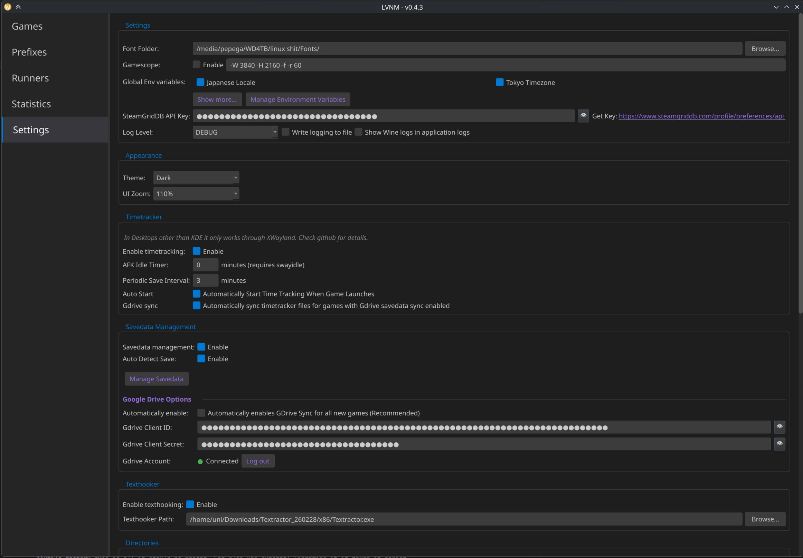
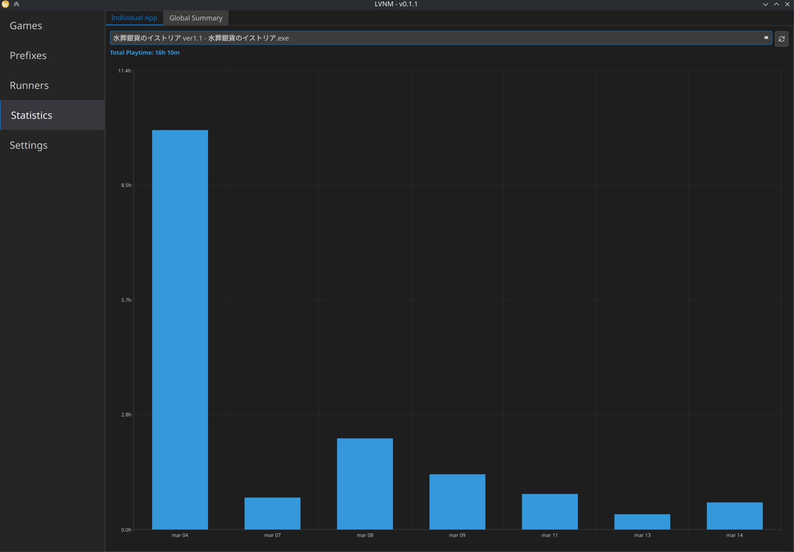

# linux-vn-manager-lvnm


Attempt at making a visual novel manager for linux. It doesn't really do anything different than other linux game launchers do since at the end of the day it's just a wine/proton wrapper, but I've focused on making life easier for VNs. Main features:

 - Run VNs or any games with proton and wine.
 - Download proton-ge and wine (normal and wow64 builds) runners directly from the application.
 - Create and manage prefixes with video codecs and winetricks easily from interface.
 - Game management to test games easily in all diferent prefixes with useful environment variables for VNs.
 - Real time tracking support to have an accurate play count (Check Timetracking section for details).
 - VNDB and SteamgridDB api integration to get covers images, hero layouts and direct links.
 - Import and export game and prefixes configuration.
 - Easy texthooking.
 - Create Steam shortcuts with covers for the Steam Deck.
 - Sync game savedata seamlessly between devices with Google Drive (check Save Data Management section for setup instructions).
 - PySide QT 6 interface.

<div align="center">
<a href=".github/images/lvnm.jpg"></a>
<table>
    <tr>
        <td><a href=".github/images/lvnm2.jpg"></a></td>
        <td><a href=".github/images/settings.jpg"></a></td>
        <td><a href=".github/images/statistics.jpg"></a></td>
    </tr>
</table>
</div>

 ##  AppImage
Releases over here: https://github.com/uunniiblog/linux-vn-manager-lvnm/releases

It bundles umu and winetricks so it runs smoothly in the Steam Deck.

## How to use
1. Runner tab -> Download wine and proton runners.
2. Prefix tab -> Create a prefix with the downloaded runner.
3. Games tab -> Add a game and set the created prefix before.

Check Settings tab to enable optional stuff like timetracking, gdrive sync, automatic fonts, etc.

For a complete list of all options in the application check the wiki: https://github.com/uunniiblog/linux-vn-manager-lvnm/wiki#how-to-use

## Import games
You can import games with their runner and prefix configuration.
In the game tab at the bottom there is a button to import. 
In the sidebar for a game, or right clicking you can also export the game with the current configuration.

I have included some import configurations for popular engines at the [game import jsons folder](game_import_jsons/) should work for most titles for the engine or developer. You only need to import the json and fill the name and path info.

## CLI Options

There are some cli options in the launcher, to get a full list:
```bash
# From source
python /path/to/linux-vn-manager-lvnm/lvnm/launcher.py -h

# From appimage
/path/to/LVNM-x86_64.appimage -h
```

The two main options are:

### Headless game run:
Run the game without gui, already used within the application for steam and desktop shortcuts
```bash
# From source
python /path/to/linux-vn-manager-lvnm/lvnm/launcher.py -r game_name

# From venv
/path/to/linux-vn-manager-lvnm/venv/bin/python /path/to/linux-vn-manager-lvnm/lvnm/launcher.py -r game_name

# From appimage
/path/to/LVNM-x86_64.appimage -r game_name
```

Use the same name game as you have the entry named in the application. It will still use the timetracking, pre and post exit script setup, etc.

### Headless timetracker 
Run the timetracker only without running the game through the application. Useful for games running through Steam so you can still get your timetracking data within lvnm, but get achievements, steam input, etc from steam.

Before using the background tracker via Steam launch options, ensure the following is set up inside the manager:

1. **Add the Game to the Application:** The game must already be added to the LVNM interface so it has an entry to record playtime to.
2. **Configure the Correct Executable Path:** The tracker watches processes based on their exact filename. The game's entry must point directly to the main game executable.
   * **How to find it on Steam:** Right-click the game in your Steam Library, select **Manage** and **Browse local files**. 
   * Locate the primary game `.exe` file, copy its full path, and paste it into the Path field inside the game sidebar in LVNM.

#### Launch from terminal:
```bash
# From source
python /path/to/linux-vn-manager-lvnm/lvnm/launcher.py -t "game_name"

# From venv
/path/to/linux-vn-manager-lvnm/venv/bin/python /path/to/linux-vn-manager-lvnm/lvnm/launcher.py -t "game_name"

# From appimage
/path/to/LVNM-x86_64.appimage -t "game_name"
```

#### Configuration for Steam

To launch the tracker alongside the game automatically, copy your command and paste it into the **Launch Options** section in the game's Steam properties:

```bash
# From source
python /path/to/linux-vn-manager-lvnm/lvnm/launcher.py -t "game_name" & %command%

# From venv
/path/to/linux-vn-manager-lvnm/venv/bin/python /path/to/linux-vn-manager-lvnm/lvnm/launcher.py -t "game_name" & %command%

# From appimage
/path/to/LVNM-x86_64.appimage -t "game_name" & %command%
```

If you face any issues I recommend to enable "Write logging to file" and check the file to detect any errors.

## Timetracking
Can be enabled in settings.

Timetracking will only track "real" playing time, it will only count the time when the game is focused so it should be somewhat accurate to your real playing time if you don't spend a lot of time in menus. 

Current working desktops:
- KDE 6: Fully working for both X11 and Wayland through KWIN queries.
- Gamescope session: In this case it will just count the time the game is open. If you minimize the game to go config controllers or other sections of Steam while game is running it will keep counting.
- Xwayland: As a fallback it uses x11_utils (python-xlib) which should work in any x11 desktop or in wayland running games through xwayland. That means any game not purposefully running through the wayland driver should still work. If you run the game with gamescope you will need to use **--backend sdl** and **SDL_VIDEODRIVER=x11** environment variable for gamescope to run as x11 to be able to timetrack it.

The tracking data is stored at **~/.local/share/lvnm/tracking/** as csv files with one line per session. If manual intervention is needed you can add/edit/delete lines there manually without issue. The info will be stored as the process name + file size in case the game has a dynamic title window, the name given in the application is changed or there are different games with same exe name like SiglusEngine.exe, etc.

Can also timetrack games that are not running through the launcher in case you still want to keep your playtime count in the application. Check CLI options for the how to.

If timetracking is enabled when a game is running it will show in the side bar the current tracking stats for the game. 
There will be a button to open a dialog where you can manually select an opened window to start tracking, or to stop current active tracking. This is useful in case you don't want to autostart the timetracker with the game, or the autostart logic can't detect the game correctly, in case it is a game with a launcher for example.

The autostart tracking detects the running by searching the pid of the process executed first. Manual tracking directly selects the window ID that the compositor gives so it is more direct and should work better in case there are issues, usually only happens with games running through launchers, or running games in unusual ways like a bat file. Both will store in the same csv file name so saved playing times will be shared between both autostart and manual.

There is an AFK idle detector timer with [swayidle](https://github.com/swaywm/swayidle). Requires manual installation through your distro, doesn't work in gaming mode in the Steam Deck.

With wayland the way of checking focused windows changes based on Desktop implementations, feel free to request PRs here or in the playtimetracker repo for other desktops. An implementation of **DesktopUtilsInterface**, plus adding the desktop to **utils_factory.py** is all it should be needed. Can also use external libraries if it makes it easier.

## Save Data Management

In settings you can enable **Savedata Management** which will enable all other settings, if you want to disable it altogether you can also disable this checkbox.
- **Auto Detect Save**: if enabled will try to find the savedata folder of the game after closing it if the savedata field is still blank.
- **Manage Savedata**: Opens a dialog with all games to see their current savedata paths. From here you can manually set them or try the auto detect feature, can also copy the saves to another prefix and configure which games you want to sync through Gdrive. Can force a Gdrive sync too. This dialog can also be opened from the sidebar next to the savedata field when Savedata Management is enabled.
- **Automatically Enable GDrive**: Enables Gdrive Sync for all new games automatically, can still disable it for individual games. I recommend to leave it on so the case where you forget to enable it for a game already in Gdrive happens, and thus creating new fresh saves instead of downloading them, potentially giving conflicts, if this happens there should still be a warning in the application letting you choose which ones to keep though.
- **Gdrive Client ID and secret**: Authorization tokens for the Google cloud saving setup. Fill them and log in. You need to leave them there for the sync to keep working.

If Gdrive sync is enabled for a game and Savedata Management checkbox is enabled the savedata will sync before and after closing the game in question. It will create a LVNM/[Game} folder in your GDrive where {Game} is the name of the game in the application, if you want to sync the same game between multiple devices make sure they have the same name in the application in all devices. Changing the name of the game will also create a new folder in GDrive and start syncing fresh there, so be careful with that.

The program will give priority to the latest modified date in case of conflicts, so the latest version of the save slots are kept. There are a couple of safeguards measure in case the Gdrive folder or all files are deleted, so your local files won't be deleted, and also in case of unresolvable conflicts at first time syncs. But as always be careful to not delete cloud saves of games you are still playing. The application Gdrive is also scoped so it can only see files the own application uploaded, this means if you manually upload a save file to a game folder the application won't read them, Use the sync now in the Savedata Management or launch the game to sync the saves.

Auto detect logic is basically a bunch of hardcoded folder names in the game folder and common save location inside the prefix searching by the game name or the original japanese name (needs to have a VNDB id to fetch this first).

To enable Google Sync for save data between multiple devices Add your own Google Cloud client project. Steps explained in the Wiki: https://github.com/uunniiblog/linux-vn-manager-lvnm/wiki/Google-Drive-Cloud-Project-Setup.

### Workflow -> Avoid Corrupting Savedata
I believe it should be straightforward and common sense, but worth reading just in case:

Once you are logged into gdrive you can enable gdrive sync per game. Once enabled when you launch and close the game it will sync the data: First time you open the game with gdrive sync enabled it will always upload your current local saves into GDrive. From there next syncs will update, modify, add or delete files by comparing modified time with an internal file tracker per device. Assuming you are using more than one PC this is generally how you want to configure it:
1. If you have a game you are already playing in both PCs: 
    - In your first PC: Simply adding the savedata path and enable GDrive sync. Launch game or manually Sync it from the dialog to upload data to Gdrive.
    - In your next PCs: Same thing: add the folder and enable Gdrive sync, when you sync it will update and compare by modified date then grab or upload new saves depending on what PC you played last.
    * Make sure the game has the same name in the application for the sync to fetch from the same Gdrive folder.
2. New game in both PCs
    - First PC: Add the game to the application. Since its a new game you don't have savedata you can't put it yet. So launch the game to create the savedata folder. Then add the path and enable gdrive sync for the game. Next time you launch it will upload to gdrive.
    - Next PCs: Add the game (with same name) to the application, enable gdrive and launch game. It will fetch the relative savedata path folder from GDrive and create the folder then download the savedata into the folder. 
    * Worst thing that can happen is that you launch the game without enabling drive and thus creating local savedata with newer modified time, and then uploading it to gdrive if you enable gdrive and sync it later. I recommend enabling the Automatically enable Gdrive checkbox at least in secondary PCs so this doesn't happen. A warning pop up will appear in this case to ask if you want to keep local or cloud saves before launching the game
    * You can also enable Gdrive sync in first launch in first PC without savedata folder, it will give a warning that there is nothing to sync, but it doesn't hurt.

If you change your prefix the savedata path of the game could also change, the application will give a warning when this can happen. To not corrupt the saves you can do one of the two things:
1. Remove the savedata path from the game -> it will fetch the relative savedata path from gdrive, create it in the new prefix and download the updated savedata there.
2. Before changing prefix, Open savedata dialog -> Click Copy to button and select the new prefix. It will copy the savedata from actual prefix to the new one.

Worst case scenario, files are never permanently deleted. Deleted files will be in the trash folder and updated files can also be restored in file information -> manage versions. 
If you need to manaully reset the file state of a game, delete the savedata path and save. then delete either GDrive folder or local save files depending what you want to keep. set up the savedata path again and start syncing.

### Steam Deck users
If you use Steam shortcuts to play the games in Gaming Mode then be careful when exiting the game to do it through the game's menu and not through Steam exit's since it sends a sigkill that forcefully closes the launcher and thus won't sync the savedata files when closing the game.

To log in in a Steam Deck if you don't want to log in with your google's account you can also open it in your phone or pc https://www.google.com/device and copy the code, there is no need to do it in the same device that you will use.


## Planned
- New UI toggle for handheld/tv mode with controller support. I believe there isn't a pure pyside6 library to help with this though, so probably will take a while.
- Native games and emulators: I want to get this working too at some point.
- Any suggestion or bugs feel free to open an issue.

## Tools and Credits
Tools used and inspiration:

- umu-launcher: https://github.com/Open-Wine-Components/umu-launcher
- proton-ge: https://github.com/GloriousEggroll/proton-ge-custom/
- wine: https://www.winehq.org/
- Kron4ek wine builds: https://github.com/Kron4ek/Wine-Builds
- Gamescope: https://github.com/ValveSoftware/gamescope
- Winetricks: https://github.com/Winetricks/winetricks/
- Codecs script: Used to install codecs: https://github.com/b-fission/vn_winestuff/
- swayidle: Used for idle/afk detection: https://github.com/swaywm/swayidle
- kdotool: Inspiration to build the timetracking for KDE: https://github.com/jinliu/kdotool
- Lutris: Interface and functionality inspiration: https://github.com/lutris/lutris
- Gdrive sync: https://github.com/googleapis/google-api-python-client
- python-xlib: Timetracking for Xwayland/X11: https://github.com/python-xlib/python-xlib

## Run from source directly
```bash
- python -m venv venv
- source venv/bin/activate
- pip install -r requirements.txt
- python lvnm/launcher.py
```

## Translation
```bash
- pyside6-lupdate lvnm/**/*.py -ts lvnm/locale/lvnm_en.ts lvnm/locale/lvnm_de.ts
- pyside6-lrelease lvnm/locale/lvnm_de.ts -qm lvnm/locale/lvnm_de.qm
```
