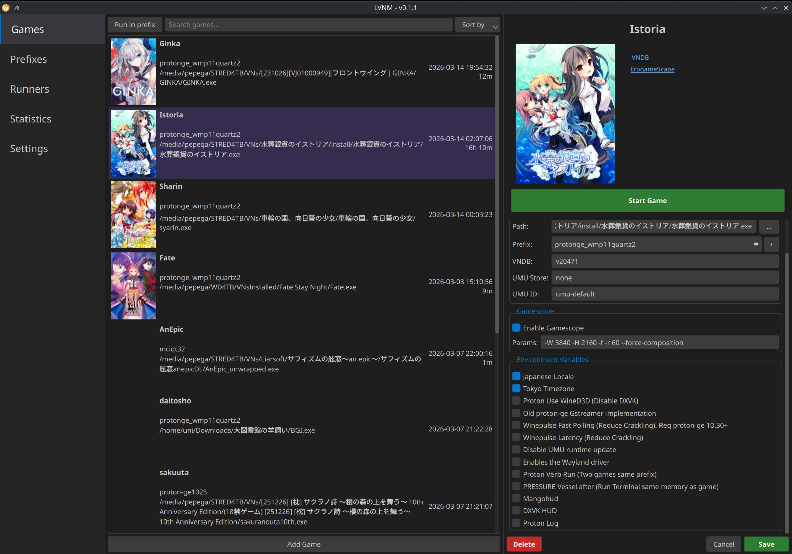

# linux-vn-manager-lvnm

Attempt at making a visual novel manager for linux. It doesn't really do anything different than other linux game launchers do since at the end of the day it's just a wine/proton wrapper, but I've focused on making life easier for VNs. Main features:

 - Run VNs or any games with proton and wine.
 - Download proton-ge and wine (normal and wow64 builds) runners directly from the application.
 - Create and manage prefixes with video codecs and winetricks easily from interface.
 - Game management to test games easily in all diferent prefixes with useful environment variables for VNs.
 - Real time tracking support to have an accurate play count (Check Timetracking section for details).
 - VNDB api integration to get covers and links.
 - Import and export game and prefixes configuration.
 - Easy texthooking.
 - Create Steam shortcuts with covers for the Steam Deck.
 - PySide QT 6 interface.

 

 ##  AppImage
Releases over here: https://github.com/uunniiblog/linux-vn-manager-lvnm/releases

It bundles umu and winetricks so it runs smoothly in the Steam Deck.

 ## How to use

 1. Runners tab: Download a runner
    - Sub tab for proton runners from steam folder ~/.local/share/Steam/compatibilitytools.d/. Can add proton-ge runners downloaded from GloriousEggroll github.
    - Sub tab for wine runners, they are stored in ~/.local/share/lvnm/runners/wine/. Can add normal amd64 and wow64 builds from Kron4ek github
    - Delete selected: Perma remove it from disk, there is a confirm window.
    - To the right of every runner there will be a list of prefixes currently using it.
 2. Prefixex tab: Make a prefix with the runners availables
    - To the right of every prefix there will be a list of games currently using it.
    - Buttons:
        - Create a prefix: Create a new prefix
            <ul>
            <li>Name: Add a identificate name, example: protonge10.25_wmp11_quartz.</li>
            <li>Path: locked field, will be stored in ~/.local/share/lvnm/prefixes/ with the name given.</li>
            <li>Runner: Select a runner from all the installed runners.</li>
            <li>Symlink fonts into prefix: Makes a symlink of the all the fonts folder configured in Settings into the new prefix.</li>
            <li>DPI: Automatically sets DPI for prefix based on monitor resolution, useful for old low resolution installers and maybe some games.</li>
            <li>Wayland driver: To activate wayland native driver at regedit level, useful for wine runners that do not have the environment variable to enable it. Do not recommended since it breaks fullscreen even harder in a lot of older VNs, but maybe useful for some cases like installers or editing winecfg. </li>
            <li>Codecs: Install custom codecs into the prefix from https://www.vnwiki.xyz/linux/special-codecs.html </li>
            <li>Winetricks: Install preconfigured winetricks. They are configured at https://github.com/uunniiblog/linux-vn-manager-lvnm/blob/main/lvnm/config.py in WINETRICKS_LIST. </li>
            <li> 32 bit prefix: Only available with wine builds that are not wow64. There isn't really much utility to it nowdays though. </li>
            </ul>
        - Edit prefix: Basically same options. I don't recommend to change name/path unless you want to break stuff.
        - Delete prefix: Perma delete a prefix, there is a confirm window.
        - Utility buttons:
            <ul>
            <li>Regedit: Opens windows registry for the prefix.</li>
            <li>Winecfg: Opens Wine configuration window for the prefix.</li>
            <li>Winefile: Opens Wine file explorer for the prefix </li>
            <li>wineboot cmd: Opens windows cmd terminal inside the prefix.</li>
            <li>Bash: Opens linux terminal with wine/proton path and WINEPREFIX env variables preloaded at prefix folder. Useful to test stuff. Inherits global environment variables. Added $RUN_GAME with the path to the wine/proton runner of the prefix</li> 
            </ul>
            All utility options are also available from the game tab.

    - Can also right click any prefix for the same options.
    - Note: When a codec or winetricks is installed it cannot be removed, will need to make a new prefix.

3. Games tab: List and run games
    - Add game: Opens sidebar to fill info to add a game
        - Name: name or whatever indicative of the game. Mandatory.
        - Path: path to the .exe of the game. click the three dots to open file system picker. Mandatory.
        - Prefix: Combo with all prefixes in the application, choose one. Mandatory.
        - VNDB: the VNDB id for the game (v11,v12, etc). Will fetch the cover and display vndb/egs link at the top. Optional.
        - Gamescope: Enable/disable gamescope and launch parameters, example: -W 3840 -H 2160 -f -r 60. Can be configured in settings to be filled automatically.
        - Environment Variables: Enable/Disable them as they fit for your game. Mouse over them to show the exact command. Can be configured in settings to be filled automatically. There are a few common environment variables preloaded in the application, but can add more or remove them freely from settings tab.
        - Some variables are exclusive to proton/wine, won't show if they don't apply.
        - Umu store and Umu ID for proton runners (not really tested but should work).
    - Edit game: Click one game from the list to show current data to edit. Same fields. Can also Start game from there.
    - Run in prefix: Run a game in a prefix without adding an entry, maybe useful to run some installers quickly. Environment variables will be gotten from global ones at settings.
    - Search: Filter games by name.
    - Sort By: sort by name, prefix, last played, or total playtime.
    - Game list
        - Can double click an entry to instantly run the game.
        - Can right click an entry to show some extra options as run game, browse files, show logs, duplicate, etc.
        - Three colums:
            <ul>
                <li>Cover: if vndb id is filled it will show real cover, otherwise empty.</li>
                <li>Name: Will show the name, with the prefix and path below. </li>
                <li>Last played date and playtime count.</li>
            </ul>
        - Steam/desktop shortcut: Right click an entry to add. The application will be run headless without GUI in this mode. Timetracking will still work in the background if enabled.
        - Label: Can right click a game to create labels (Playing, Finished, etc) to group games in sections. Sections can be expaned or collapsed to hide all the games in one section. Can right click over the header of a section to delete it.
        - Export and Import: from the sidebar or right clicking a game you can export the configuration of the game and prefix in a json file. It can be imported with the Import button at the botton next to add game.
4. Statistics tab: If timetracking has been enabled when you run a game it will count your playtime. This tab shows some simple graphs by app or global based on your playtime.
5. Settings tab
    - Functional Settings:
        - Font folder: Path to a folder with your fonts. This fonts can be symlinked to prefixes to reduce disk space.
        - Gamescope: Enable gamescope and global parameters. When you add a game this setting will be automatically loaded, can be edited later per game as it fit.
        - Global Env Variables: Enable global environt variables checkboxes. When you add a game this setting will be automatically loaded, can be edited later per game as it fit. Will also be used when running a game in "Run in prefix".
        - Manage Variables: To add and remove new environment variables, if you remove one variable from the application being used by a game it will be deleted from the game.
    - Appearance Settings:
        - Dark/Light mode.
        - Ui scaling.
    - Timetracker: Enable/disable it
        - AFK Idle timer: timer to stop counting in case you go afk with the game focused. Requires [swayidle](https://github.com/swaywm/swayidle) to be installed.
        - Periodic save interval: Save the session every X minutes in case of power shutdown or app crash.
        - Autostart: Choose if start autotracking when the game opens or not. If not you can start tracking manually from the sidebar once the game is running.
    - Texthooking: Enable/disable it
        - Path: Select the .exe of your texthooker. Right click a running game "Open Texthooker" to run it targeted to the game.
        - Textractor will automatically hook to the game with -pgame.exe, also tested Luna and Agent, both can hook through the program's interface. 
        - Note that some hook codes behave differently through wine/proton and may crash the game.
    - Directories: Modify paths of data folders for prefixes, runners, vndb covers and timetracker log files. Useful if you have low disk space in your main system drive. Restart the application after doing any changes here to fully reload the new paths.
    - System info: List useful system info and gstreamer libraries I have found pretty useful to run videos in VNs with wow64 wine builds.

Config and data stored at: ~/.local/share/lvnm/

## Timetracking
Can be enabled in settings.

Timetracking will only track "real" playing time, it will only count the time when the game is focused so it should be somewhat accurate to your real playing time if you don't spend a lot of time in menus. 

Current working desktops:
- KDE 6: Fully working for both X11 and Wayland through KWIN queries.
- Gamescope session: In this case it will just count the time the game is open. If you minimize the game to go config controllers or other sections of Steam while game is running it will keep counting.

As a fallback it uses x11_utils (python-xlib) which should work in any x11 desktop and through xwayland. That means any game not purposefully running through the wayland driver should still work. If you run the game with gamescope you will need to use --backend sdl and SDL_VIDEODRIVER=x11 environment variable for gamescope to run as x11 to be able to timetrack it.

The tracking data is stored at ~/.local/share/lvnm/tracking/ as csv files with one line per session. If manual intervention is needed you can add/edit/delete lines there manually without issue. The info will be stored as the process name + file size in case the game has a dynamic title window, the name given in the application is changed or there are different games with same exe name like SiglusEngine.exe, etc.

I brought the timetracking from another application I made last year, If you want it as a standalone application it is here: https://github.com/uunniiblog/playtimetracker Although it is a bit outdated compared to the version here.

With wayland the way of checking focused windows changes based on Desktop implementations, feel free to request PRs here or in the playtimetracker repo for other desktops. An implementation of DesktopUtilsInterface, plus adding the desktop to utils_factory.py is all it should be needed. Can also use external libraries if it makes it easier.

If timetracking is enabled when a game is running it will show in the side bar the current tracking stats for the game. 
There will be a button to open a dialog where you can manually select an opened window to start tracking, or to stop current active tracking. This is useful in case you don't want to autostart the timetracker with the game, or the autostart logic can't detect the game correctly, in case it is a game with a launcher for example.

The autostart tracking detects the running by searching the pid of the process executed first. Manual tracking directly selects the window ID that the compositor gives so it is more direct and should work better. Both will store in the same csv file name so saved playing times will be shared between both autostart and manual.

## Planned
- Save data management: move all game saves to a shared folder in case of prefix deletions no data is lost. Try to auto detect common save paths for VNs
- One game one prefix. Automatically copies the selected prefix making prefixes unique per games.
- More suggestions are always welcomed.

## Tools and Credits
Tools used and inspiration:

- umu-launcher: https://github.com/Open-Wine-Components/umu-launcher
- proton-ge: https://github.com/GloriousEggroll/proton-ge-custom/
- wine: https://www.winehq.org/
- Kron4ek wine builds: https://github.com/Kron4ek/Wine-Builds
- Gamescope: https://github.com/ValveSoftware/gamescope
- Winetricks: https://github.com/Winetricks/winetricks/
- Codecs: https://github.com/b-fission/vn_winestuff/
- swayidle: for idle/afk detection: https://github.com/swaywm/swayidle
- kdotool: Inspiration to build the timetracking for KDE: https://github.com/jinliu/kdotool
- Lutris: Interface and functionality inspiration: https://github.com/lutris/lutris

## Run from source directly
- python -m venv venv
- source venv/bin/activate
- pip install -r requirements.txt
- python lvnm/launcher.py
